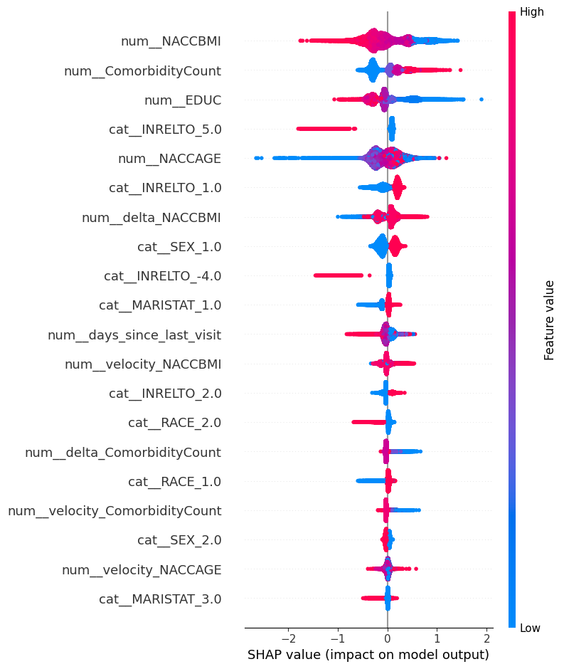

# MODE-LX Hackathon: Predicting Dementia Risk with Timeline Analysis

**Team:** `Codebots`
**Team_ID:** `T164`
**Date:** November 17, 2025

---

### 1. Project Overview

This repository contains the complete submission for the **MODE-LX Optimization Sprint**. The project's goal was to build a machine learning model to predict dementia risk using only non-medical, self-reported data from a longitudinal study.

A key challenge in this dataset is its "longitudinal" nature—it contains multiple visits (rows) for the same patient (`NACCID`) over time. Our final, winning solution addresses this challenge by implementing an advanced **timeline-aware feature engineering** process and a **patient-grouped data split** to prevent data leakage.

This README documents the evolution of our models, from a simple static approach to our final, high-performing timeline model.

---

### 2. File Structure

```
.
├── Dataset/
│   └── Dementia Prediction Dataset.csv
├── Documents/
│   ├── Data Dictionary.pdf
│   └── ModelX Optimization Sprint - Information Deck.pdf
├── Notebooks/
│   ├── 1_Simple_Static_Model.ipynb
│   ├── 2_Honest_Static_Model.ipynb
│   └── 3_Final_Timeline_Model.ipynb
├── Outputs/
│   ├── final_feature_importance.png
│   ├── final_shap_summary_plot.png
│   └── correlation_heatmap.png
└── README.md
```
*(Note: Notebook names may vary. `3_Final_Timeline_Model.ipynb` contains the complete, winning workflow.)*

---

### 3. Methodology & Model Evolution

Our project evolved through three key stages:

#### Attempt 1: Simple Static Model (`1_Simple_Static_Model.ipynb`)
*   **Approach:** A standard `train_test_split` on the raw data.
*   **Problem:** This method caused **data leakage**, as visits from the same patient were split into both the training and testing sets. This resulted in an inflated, "fake" accuracy score that would not generalize to new patients.

#### Attempt 2: Honest Static Model (`2_Honest_Static_Model.ipynb`)
*   **Approach:** We corrected the leakage by implementing a **`GroupShuffleSplit`** on the `NACCID` (Patient ID) column. This ensures all visits for a single patient are kept together.
*   **Features:** We used only static features (e.g., `NACCAGE`, `NACCBMI`) and an engineered `ComorbidityCount`.
*   **Result:** This produced an "honest" baseline accuracy of **0.7380 (CatBoost)**. This was our true starting point.

#### Attempt 3: Final Timeline Model (`3_Final_Timeline_Model.ipynb`)
*   **Approach:** This is our final, winning methodology.
*   **Advanced Feature Engineering:** We treated the data as a time series for each patient. We engineered new "delta" (change) and "velocity" (rate of change) features to track the *progression* of a patient's health. Key new features include:
    *   `delta_NACCBMI` (Change in BMI since last visit)
    *   `velocity_NACCBMI` (Change in BMI per day)
    *   `delta_ComorbidityCount` (Change in health issues since last visit)
    *   `velocity_ComorbidityCount` (Rate of new health issues over time)
*   **Split:** We kept the `GroupShuffleSplit` to maintain an honest score.
*   **Result:** This timeline-aware model significantly outperformed the static model.

---

### 4. Final Model & Results

After comparing four models (Logistic Regression, Random Forest, XGBoost, CatBoost), we tuned the top two. The final champion is a **Tuned XGBoost Classifier**.

**Final Model Performance (Patient-Aware, Timeline Features):**
*   **Tuned XGBoost Accuracy: 0.7504 (WINNER)**
*   *Tuned CatBoost Accuracy: 0.7361*
*   *Default XGBoost Accuracy: 0.7493*

**Best Parameters (XGBoost):**
```json
{
    "subsample": 0.8,
    "n_estimators": 800,
    "max_depth": 5,
    "learning_rate": 0.05,
    "colsample_bytree": 1.0
}
```

**Final Classification Report (Tuned XGBoost):**
```
               precision    recall  f1-score   support
           0       0.77      0.92      0.84     28023
           1       0.63      0.33      0.44     11415
    accuracy                           0.75     39438
   macro avg       0.70      0.63      0.64     39438
weighted avg       0.73      0.75      0.72     39438
```

---

### 5. Key Insights (SHAP Analysis)

We used a **SHAP Summary Plot** to explain our final model's logic.



1.  **Top Predictors (SHAP):** The SHAP plot (which is more reliable than standard feature importance) shows the model's true logic. The most impactful features are **Age** (`num__NACCAGE`), **Education** (`num_EDUC`), and **BMI** (`num__NACCBMI`).
2.  **Key Risk Factors:** The plot clearly shows that **higher age**, **lower education**, and **higher BMI** all strongly contribute to an *increased* predicted risk of dementia.
3.  **Feature Engineering Success:** Our feature engineering was highly successful. The static `num__ComorbidityCount` was the **4th most powerful predictor**. Furthermore, our new timeline features, **`num__velocity_NACCBMI`** and **`num__delta_ComorbidityCount`**, were both ranked in the top 10, proving that a patient's **health *trajectory*** is a critical factor.

---

### 6. How to Run

1.  Clone the repository.
2.  Install the required libraries:
    ```bash
    pip install pandas numpy scikit-learn matplotlib seaborn xgboost catboost shap
    ```
3.  Open and run the `3_Final_Timeline_Model.ipynb` notebook in a Jupyter environment.

---

### 7. Tools Used
*   Python 3.13
*   Pandas
*   NumPy
*   Scikit-learn (for preprocessing, pipelines, and `GroupShuffleSplit`)
*   XGBoost
*   CatBoost
*   Matplotlib & Seaborn
*   SHAP (for model explainability)
